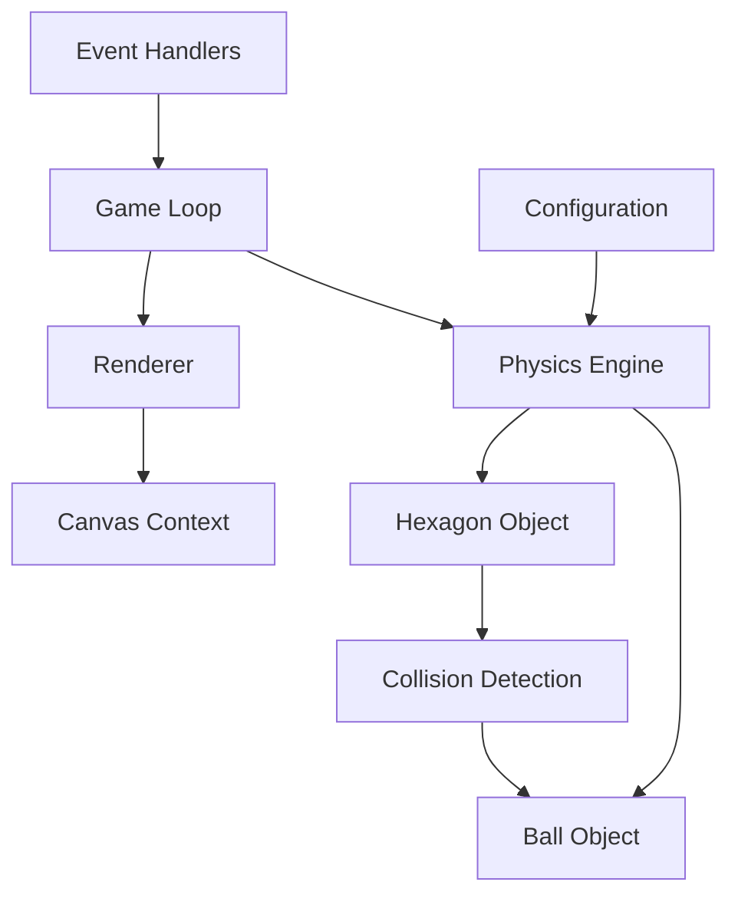

# Design Document

## Overview

这个项目将创建一个基于HTML5 Canvas的物理模拟，展示一个小球在旋转六边形容器内的真实物理行为。系统采用面向对象的架构设计，将渲染、物理计算和游戏逻辑分离，确保代码的可维护性和扩展性。

核心技术栈包括：
- HTML5 Canvas 2D API用于图形渲染
- JavaScript ES6+用于逻辑实现
- CSS3用于响应式布局
- requestAnimationFrame用于流畅动画

## Architecture

### 系统架构图



### 核心架构原则

1. **分离关注点**: 物理计算、渲染和游戏逻辑独立模块化
2. **数据驱动**: 物理参数和配置可调整
3. **性能优先**: 使用高效算法和优化技术
4. **响应式设计**: 适配不同屏幕尺寸

## Components and Interfaces

### 1. Game Class (主游戏控制器)

```javascript
class Game {
    constructor(canvasId, config)
    init()
    start()
    stop()
    gameLoop(timestamp)
    handleResize()
}
```

**职责:**
- 管理游戏生命周期
- 协调各个组件
- 处理动画循环
- 响应窗口大小变化

### 2. Ball Class (小球物理对象)

```javascript
class Ball {
    constructor(x, y, radius, mass)
    update(deltaTime)
    applyForce(force)
    setPosition(x, y)
    setVelocity(vx, vy)
}
```

**属性:**
- position: {x, y} - 位置坐标
- velocity: {x, y} - 速度向量
- acceleration: {x, y} - 加速度向量
- radius: number - 半径
- mass: number - 质量

### 3. Hexagon Class (六边形容器)

```javascript
class Hexagon {
    constructor(centerX, centerY, radius)
    rotate(angle)
    getVertices()
    checkCollision(ball)
    getCollisionNormal(point)
    isPointInside(point)
}
```

**职责:**
- 管理六边形几何
- 处理旋转变换
- 碰撞检测
- 计算法向量

### 4. PhysicsEngine Class (物理引擎)

```javascript
class PhysicsEngine {
    constructor(config)
    update(ball, hexagon, deltaTime)
    applyGravity(ball, deltaTime)
    applyFriction(ball)
    handleCollision(ball, hexagon)
}
```

**物理常数:**
- GRAVITY: 9.81 (适配屏幕比例)
- FRICTION_COEFFICIENT: 0.98
- RESTITUTION: 0.8 (反弹系数)

### 5. Renderer Class (渲染器)

```javascript
class Renderer {
    constructor(canvas)
    clear()
    drawHexagon(hexagon)
    drawBall(ball)
    setViewport(width, height)
}
```

**渲染特性:**
- 抗锯齿渲染
- 颜色和样式配置
- 高DPI屏幕支持

## Data Models

### Vector2D 数据结构

```javascript
class Vector2D {
    constructor(x = 0, y = 0)
    add(vector)
    subtract(vector)
    multiply(scalar)
    magnitude()
    normalize()
    dot(vector)
    rotate(angle)
}
```

### Configuration 对象

```javascript
const CONFIG = {
    physics: {
        gravity: 9.81,
        friction: 0.98,
        restitution: 0.8,
        timeScale: 0.016
    },
    hexagon: {
        radius: 200,
        rotationSpeed: 0.5,
        strokeWidth: 3,
        color: '#2196F3'
    },
    ball: {
        radius: 10,
        mass: 1,
        color: '#FF5722',
        initialPosition: {x: 0, y: -50},
        initialVelocity: {x: 100, y: 0}
    },
    canvas: {
        backgroundColor: '#f5f5f5',
        width: 800,
        height: 600
    }
};
```

## Error Handling

### 1. Canvas 初始化错误

```javascript
try {
    const canvas = document.getElementById(canvasId);
    if (!canvas) {
        throw new Error(`Canvas element with id '${canvasId}' not found`);
    }
    const ctx = canvas.getContext('2d');
    if (!ctx) {
        throw new Error('2D context not supported');
    }
} catch (error) {
    console.error('Canvas initialization failed:', error);
    // 显示错误信息给用户
}
```

### 2. 物理计算边界检查

```javascript
// 防止数值溢出和NaN
if (!isFinite(velocity.x) || !isFinite(velocity.y)) {
    velocity.x = 0;
    velocity.y = 0;
    console.warn('Invalid velocity detected, reset to zero');
}

// 速度限制
const MAX_VELOCITY = 1000;
if (velocity.magnitude() > MAX_VELOCITY) {
    velocity.normalize().multiply(MAX_VELOCITY);
}
```

### 3. 性能监控

```javascript
class PerformanceMonitor {
    constructor() {
        this.frameCount = 0;
        this.lastTime = 0;
        this.fps = 0;
    }
    
    update(timestamp) {
        this.frameCount++;
        if (timestamp - this.lastTime >= 1000) {
            this.fps = this.frameCount;
            this.frameCount = 0;
            this.lastTime = timestamp;
            
            if (this.fps < 30) {
                console.warn(`Low FPS detected: ${this.fps}`);
            }
        }
    }
}
```

## Testing Strategy

### 1. 单元测试

**Vector2D 类测试:**
```javascript
describe('Vector2D', () => {
    test('should calculate magnitude correctly', () => {
        const vector = new Vector2D(3, 4);
        expect(vector.magnitude()).toBe(5);
    });
    
    test('should normalize vector correctly', () => {
        const vector = new Vector2D(3, 4);
        const normalized = vector.normalize();
        expect(normalized.magnitude()).toBeCloseTo(1);
    });
});
```

**物理引擎测试:**
```javascript
describe('PhysicsEngine', () => {
    test('should apply gravity correctly', () => {
        const ball = new Ball(0, 0, 10, 1);
        const engine = new PhysicsEngine(CONFIG);
        engine.applyGravity(ball, 0.016);
        expect(ball.velocity.y).toBeGreaterThan(0);
    });
});
```

### 2. 集成测试

**碰撞检测测试:**
- 测试小球与六边形各边的碰撞
- 验证反弹角度计算
- 检查能量守恒

**旋转测试:**
- 验证六边形旋转时碰撞检测的准确性
- 测试不同旋转速度下的表现

### 3. 性能测试

**帧率测试:**
- 监控不同设备上的FPS
- 测试长时间运行的稳定性
- 内存使用情况监控

**响应式测试:**
- 不同屏幕尺寸下的表现
- 窗口大小变化时的适应性
- 移动设备触摸交互

### 4. 视觉测试

**物理行为验证:**
- 重力效果是否自然
- 摩擦力是否合理
- 反弹是否符合物理定律

**动画流畅性:**
- 旋转动画是否平滑
- 小球运动是否连续
- 无明显卡顿或跳跃

## 实现细节

### 六边形几何计算

```javascript
// 计算六边形顶点
getVertices() {
    const vertices = [];
    for (let i = 0; i < 6; i++) {
        const angle = (i * Math.PI) / 3 + this.rotation;
        const x = this.center.x + this.radius * Math.cos(angle);
        const y = this.center.y + this.radius * Math.sin(angle);
        vertices.push(new Vector2D(x, y));
    }
    return vertices;
}
```

### 碰撞检测算法

```javascript
// 点到线段距离和法向量计算
getCollisionInfo(point, lineStart, lineEnd) {
    const line = lineEnd.subtract(lineStart);
    const pointToStart = point.subtract(lineStart);
    const projection = pointToStart.dot(line) / line.dot(line);
    
    // 限制投影在线段范围内
    const clampedProjection = Math.max(0, Math.min(1, projection));
    const closestPoint = lineStart.add(line.multiply(clampedProjection));
    
    const distance = point.subtract(closestPoint).magnitude();
    const normal = point.subtract(closestPoint).normalize();
    
    return { distance, normal, closestPoint };
}
```

### 响应式Canvas设置

```javascript
setupResponsiveCanvas() {
    const container = this.canvas.parentElement;
    const rect = container.getBoundingClientRect();
    
    // 设置Canvas实际尺寸
    this.canvas.width = rect.width * window.devicePixelRatio;
    this.canvas.height = rect.height * window.devicePixelRatio;
    
    // 设置CSS尺寸
    this.canvas.style.width = rect.width + 'px';
    this.canvas.style.height = rect.height + 'px';
    
    // 缩放上下文以适应高DPI
    this.ctx.scale(window.devicePixelRatio, window.devicePixelRatio);
}
```