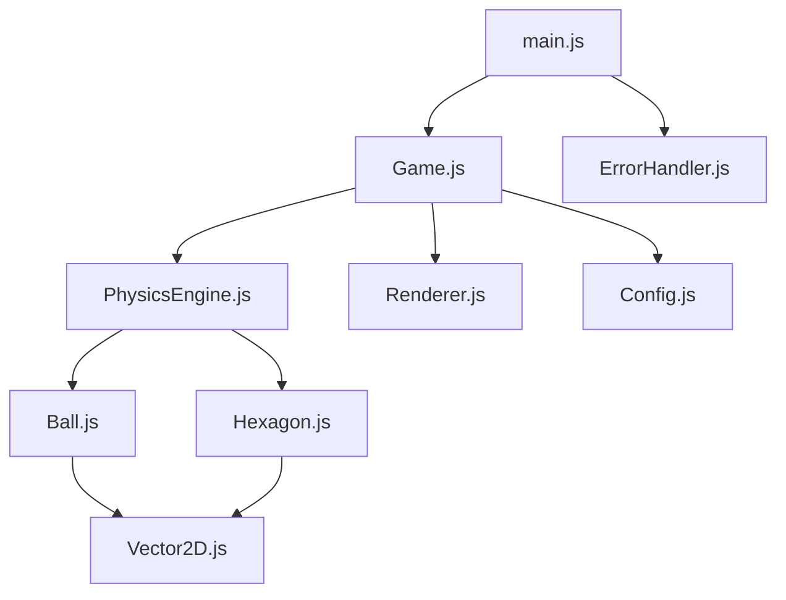

# 🎯 Rotating Hexagon Ball Physics Simulation

🇺🇸 English | [🇨🇳 中文](README.md)

An interactive physics simulation application based on HTML5 Canvas, showcasing realistic physics engine effects.


## ✨ Features

### 🎮 Core Functionality
- **Realistic Physics Engine** - Gravity, friction, collision detection
- **Rotating Hexagon Container** - Dynamic boundary collisions
- **Smooth Animation** - 60FPS high-performance rendering
- **Responsive Design** - Adapts to all device sizes

### 🎛️ User Interaction
- **Keyboard Controls** - Space to pause, R to reset, D for debug
- **Mouse Interaction** - Click control and position reset
- **Touch Support** - Mobile device friendly
- **Real-time Configuration** - Dynamic adjustment of physics parameters

### ⚡ Performance Optimization
- **Automatic Performance Detection** - Auto-optimization based on device
- **Batch Rendering** - Reduces GPU state switching
- **Memory Management** - Intelligent garbage collection
- **Error Recovery** - Graceful error handling

### 🎨 Visual Effects
- **High DPI Support** - Clear high-resolution rendering
- **Debug Visualization** - Velocity vectors, collision point display
- **Performance Monitoring** - Real-time FPS and performance data
- **Notification System** - Elegant user feedback

## 🚀 Quick Start

### Online Experience
Simply open the `index.html` file in your browser to start experiencing.

### Local Setup
```bash
# Clone the project
git clone https://github.com/zym9863/hexagon2.git

# Enter project directory
cd hexagon2

# Run with local server (recommended)
python -m http.server 8000
# Or use Node.js
npx serve .

# Access in browser
open http://localhost:8000
```

### System Requirements
- Modern browsers (Chrome 60+, Firefox 55+, Safari 12+, Edge 79+)
- HTML5 Canvas and ES6+ support
- Browsers with hardware acceleration recommended

## 🎮 Usage Guide

### Basic Controls

| Action | Keyboard | Mouse/Touch |
|--------|----------|-------------|
| Pause/Resume | Space | Click pause button |
| Reset Game | R key | Click reset button |
| Debug Mode | D key | - |
| Performance Mode | P key | - |
| Preset Configs | 1-5 keys | - |

### Advanced Features

#### Debug Console
```javascript
// Open browser console and use these commands:

gameDebug.help()                    // Show help information
gameDebug.getGameState()            // Get game state
gameDebug.setBallPosition(100, 50)  // Set ball position
gameDebug.applyPreset('bouncy')     // Apply bouncy preset
gameDebug.takeScreenshot()          // Save screenshot
```

#### Configuration Presets
- **Default** - Balanced default settings
- **Bouncy** - High elasticity, great for observing bounce effects
- **Sticky** - High friction, ball stops quickly
- **Space** - Low gravity, simulates space environment
- **Spinner** - Fast rotation, adds dynamic effects

## 🏗️ Technical Architecture

### Core Components



### Design Patterns
- **Modular Architecture** - Clear separation of responsibilities
- **Observer Pattern** - Event-driven configuration updates
- **Strategy Pattern** - Switchable performance optimization strategies
- **Singleton Pattern** - Global configuration and error handling

### Performance Features
- **requestAnimationFrame** - Smooth 60FPS animation
- **Canvas Optimization** - Batch drawing and state caching
- **Memory Management** - Object pooling and garbage collection optimization
- **Responsive Rendering** - Adaptive resolution and DPI

## 🧪 Testing

### Run Tests
```bash
# Add test parameter to URL
http://localhost:8000/?test=true

# Or run in console
gameDebug.runTests()
```

### Test Coverage
- ✅ Vector math operations
- ✅ Physics engine calculations
- ✅ Collision detection algorithms
- ✅ Rendering performance
- ✅ Configuration system
- ✅ Error handling
- ✅ Cross-browser compatibility

## 📱 Responsive Support

### Screen Adaptation
| Device Type | Screen Size | Optimization Features |
|-------------|-------------|----------------------|
| Desktop | 1200px+ | Full features, high performance |
| Tablet | 768-1199px | Touch optimized |
| Mobile | <768px | Mobile optimized, simplified UI |

### Performance Adjustment
- **Auto Detection** - Automatically adjusts based on device performance
- **Manual Control** - Users can manually switch performance modes
- **Graceful Degradation** - Low-performance devices auto-simplify effects

## 🔧 Configuration Options

### Physics Parameters
```javascript
const physicsConfig = {
    gravity: 490.5,              // Gravitational acceleration
    frictionCoefficient: 0.98,   // Friction coefficient
    restitution: 0.8,            // Restitution coefficient
    airResistance: 0.999,        // Air resistance
    maxVelocity: 1000            // Maximum velocity limit
};
```

### Visual Parameters
```javascript
const visualConfig = {
    hexagon: {
        radius: 200,             // Hexagon radius
        rotationSpeed: 0.5,      // Rotation speed
        strokeColor: '#2196F3'   // Border color
    },
    ball: {
        radius: 10,              // Ball radius
        color: '#FF5722'         // Ball color
    }
};
```

## 🛠️ Development Guide

### Project Structure
```
├── index.html              # Main page
├── styles.css              # Style files
├── js/                     # JavaScript source code
│   ├── main.js            # Application entry
│   ├── Game.js            # Game controller
│   ├── PhysicsEngine.js   # Physics engine
│   ├── Renderer.js        # Rendering engine
│   ├── Ball.js            # Ball object
│   ├── Hexagon.js         # Hexagon object
│   ├── Vector2D.js        # Vector mathematics
│   ├── Config.js          # Configuration system
│   └── ErrorHandler.js    # Error handling
├── test/                   # Test files
└── docs/                   # Documentation
```

### Adding New Features
1. Add methods to appropriate classes
2. Update configuration system (if needed)
3. Add unit tests
4. Update documentation

### Code Standards
- Use ES6+ syntax
- Follow JSDoc comment standards
- Maintain single responsibility principle
- Write testable code

## 🐛 Troubleshooting

### Common Issues

**Q: Game won't start**
A: Check browser console for errors, ensure HTML5 Canvas support

**Q: Poor performance**
A: Press P to switch to low performance mode, or close other tabs

**Q: Touch not responding**
A: Ensure using modern mobile browser, clear cache and retry

**Q: Configuration not taking effect**
A: Use `gameDebug.reset()` to reset configuration, then reconfigure

### Debug Tips
```javascript
// Check game state
console.log(gameDebug.getGameState());

// Check performance info
console.log(gameDebug.getPerformanceInfo());

// Check configuration
console.log(gameDebug.exportConfig());
```

## 🤝 Contributing

Contributions are welcome! Please follow these steps:

1. Fork the project
2. Create feature branch (`git checkout -b feature/AmazingFeature`)
3. Commit changes (`git commit -m 'Add some AmazingFeature'`)
4. Push to branch (`git push origin feature/AmazingFeature`)
5. Open Pull Request

### Contribution Guidelines
- Maintain consistent code style
- Add appropriate tests
- Update relevant documentation
- Ensure backward compatibility

## 📄 License

This project is licensed under the MIT License - see the [LICENSE](LICENSE) file for details.

## 🙏 Acknowledgments

- HTML5 Canvas API
- Excellent performance of modern browsers
- Support and inspiration from the open source community

---

**⭐ If this project helps you, please give it a star!**

*A complete example project showcasing modern web technology and physics engines*