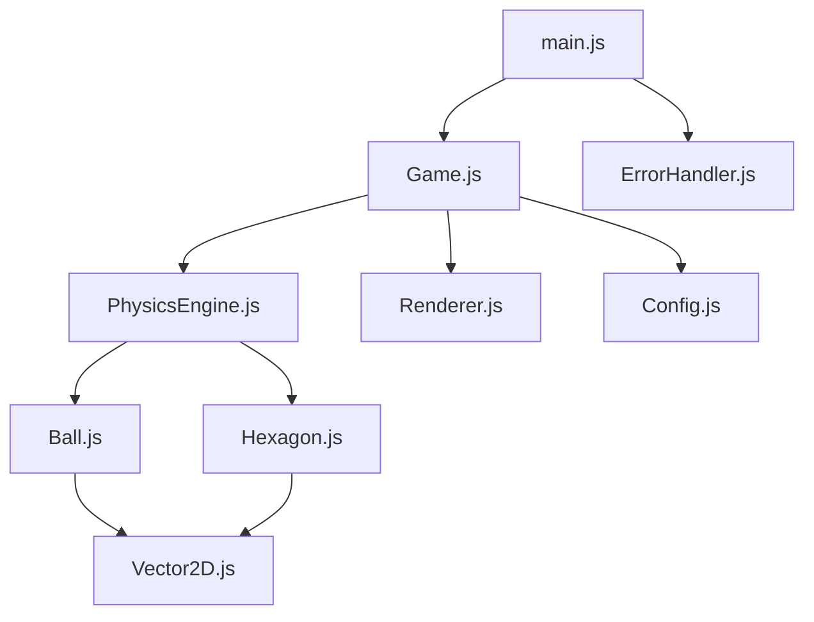

# 🎯 旋转六边形小球物理模拟

[🇺🇸 English](README-EN.md) | 🇨🇳 中文

一个基于HTML5 Canvas的交互式物理模拟应用程序，展示真实的物理引擎效果。


## ✨ 特性

### 🎮 核心功能
- **真实物理引擎** - 重力、摩擦力、碰撞检测
- **旋转六边形容器** - 动态边界碰撞
- **流畅动画** - 60FPS高性能渲染
- **响应式设计** - 适配所有设备尺寸

### 🎛️ 用户交互
- **键盘控制** - 空格暂停、R重置、D调试
- **鼠标交互** - 点击控制和位置重置
- **触摸支持** - 移动设备友好
- **实时配置** - 动态调整物理参数

### ⚡ 性能优化
- **自动性能检测** - 根据设备自动优化
- **批量渲染** - 减少GPU状态切换
- **内存管理** - 智能垃圾回收
- **错误恢复** - 优雅的错误处理

### 🎨 视觉效果
- **高DPI支持** - 清晰的高分辨率渲染
- **调试可视化** - 速度向量、碰撞点显示
- **性能监控** - 实时FPS和性能数据
- **通知系统** - 优雅的用户反馈

## 🚀 快速开始

### 在线体验
直接在浏览器中打开 `index.html` 文件即可开始体验。

### 本地运行
```bash
# 克隆项目
git clone https://github.com/zym9863/hexagon2.git

# 进入项目目录
cd hexagon2

# 使用本地服务器运行（推荐）
python -m http.server 8000
# 或使用Node.js
npx serve .

# 在浏览器中访问
open http://localhost:8000
```

### 系统要求
- 现代浏览器（Chrome 60+, Firefox 55+, Safari 12+, Edge 79+）
- 支持HTML5 Canvas和ES6+
- 建议使用支持硬件加速的浏览器

## 🎮 使用指南

### 基本控制

| 操作 | 键盘 | 鼠标/触摸 |
|------|------|-----------|
| 暂停/继续 | 空格键 | 点击暂停按钮 |
| 重置游戏 | R键 | 点击重置按钮 |
| 调试模式 | D键 | - |
| 性能模式 | P键 | - |
| 预设配置 | 1-5键 | - |

### 高级功能

#### 调试控制台
```javascript
// 打开浏览器控制台，使用以下命令：

gameDebug.help()                    // 显示帮助信息
gameDebug.getGameState()            // 获取游戏状态
gameDebug.setBallPosition(100, 50)  // 设置小球位置
gameDebug.applyPreset('bouncy')     // 应用弹性预设
gameDebug.takeScreenshot()          // 保存截图
```

#### 配置预设
- **Default** - 平衡的默认设置
- **Bouncy** - 高弹性，适合观察反弹效果
- **Sticky** - 高摩擦，小球会快速停止
- **Space** - 低重力，模拟太空环境
- **Spinner** - 快速旋转，增加动态效果

## 🏗️ 技术架构

### 核心组件



### 设计模式
- **模块化架构** - 清晰的职责分离
- **观察者模式** - 事件驱动的配置更新
- **策略模式** - 可切换的性能优化策略
- **单例模式** - 全局配置和错误处理

### 性能特性
- **requestAnimationFrame** - 流畅的60FPS动画
- **Canvas优化** - 批量绘制和状态缓存
- **内存管理** - 对象池和垃圾回收优化
- **响应式渲染** - 自适应分辨率和DPI

## 🧪 测试

### 运行测试
```bash
# 在URL中添加测试参数
http://localhost:8000/?test=true

# 或在控制台中运行
gameDebug.runTests()
```

### 测试覆盖
- ✅ 向量数学运算
- ✅ 物理引擎计算
- ✅ 碰撞检测算法
- ✅ 渲染性能
- ✅ 配置系统
- ✅ 错误处理
- ✅ 跨浏览器兼容性

## 📱 响应式支持

### 屏幕适配
| 设备类型 | 屏幕尺寸 | 优化特性 |
|----------|----------|----------|
| 桌面 | 1200px+ | 完整功能，高性能 |
| 平板 | 768-1199px | 触摸优化 |
| 手机 | <768px | 移动优化，简化UI |

### 性能调节
- **自动检测** - 根据设备性能自动调整
- **手动控制** - 用户可手动切换性能模式
- **优雅降级** - 低性能设备自动简化效果

## 🔧 配置选项

### 物理参数
```javascript
const physicsConfig = {
    gravity: 490.5,              // 重力加速度
    frictionCoefficient: 0.98,   // 摩擦系数
    restitution: 0.8,            // 反弹系数
    airResistance: 0.999,        // 空气阻力
    maxVelocity: 1000            // 最大速度限制
};
```

### 视觉参数
```javascript
const visualConfig = {
    hexagon: {
        radius: 200,             // 六边形半径
        rotationSpeed: 0.5,      // 旋转速度
        strokeColor: '#2196F3'   // 边框颜色
    },
    ball: {
        radius: 10,              // 小球半径
        color: '#FF5722'         // 小球颜色
    }
};
```

## 🛠️ 开发指南

### 项目结构
```
├── index.html              # 主页面
├── styles.css              # 样式文件
├── js/                     # JavaScript源码
│   ├── main.js            # 应用入口
│   ├── Game.js            # 游戏控制器
│   ├── PhysicsEngine.js   # 物理引擎
│   ├── Renderer.js        # 渲染引擎
│   ├── Ball.js            # 小球对象
│   ├── Hexagon.js         # 六边形对象
│   ├── Vector2D.js        # 向量数学
│   ├── Config.js          # 配置系统
│   └── ErrorHandler.js    # 错误处理
├── test/                   # 测试文件
└── docs/                   # 文档
```

### 添加新功能
1. 在相应的类中添加方法
2. 更新配置系统（如需要）
3. 添加单元测试
4. 更新文档

### 代码规范
- 使用ES6+语法
- 遵循JSDoc注释标准
- 保持函数单一职责
- 编写可测试的代码

## 🐛 故障排除

### 常见问题

**Q: 游戏无法启动**
A: 检查浏览器控制台错误，确保支持HTML5 Canvas

**Q: 性能较差**
A: 按P键切换到低性能模式，或关闭其他标签页

**Q: 触摸不响应**
A: 确保使用现代移动浏览器，清除缓存后重试

**Q: 配置不生效**
A: 使用`gameDebug.reset()`重置配置，然后重新设置

### 调试技巧
```javascript
// 检查游戏状态
console.log(gameDebug.getGameState());

// 检查性能信息
console.log(gameDebug.getPerformanceInfo());

// 检查配置
console.log(gameDebug.exportConfig());
```

## 🤝 贡献

欢迎贡献代码！请遵循以下步骤：

1. Fork 项目
2. 创建功能分支 (`git checkout -b feature/AmazingFeature`)
3. 提交更改 (`git commit -m 'Add some AmazingFeature'`)
4. 推送到分支 (`git push origin feature/AmazingFeature`)
5. 开启 Pull Request

### 贡献指南
- 保持代码风格一致
- 添加适当的测试
- 更新相关文档
- 确保向后兼容

## 📄 许可证

本项目采用 MIT 许可证 - 查看 [LICENSE](LICENSE) 文件了解详情。

## 🙏 致谢

- HTML5 Canvas API
- 现代浏览器的优秀性能
- 开源社区的支持和灵感

---

**⭐ 如果这个项目对你有帮助，请给它一个星标！**

*一个展示现代Web技术和物理引擎的完整示例项目*